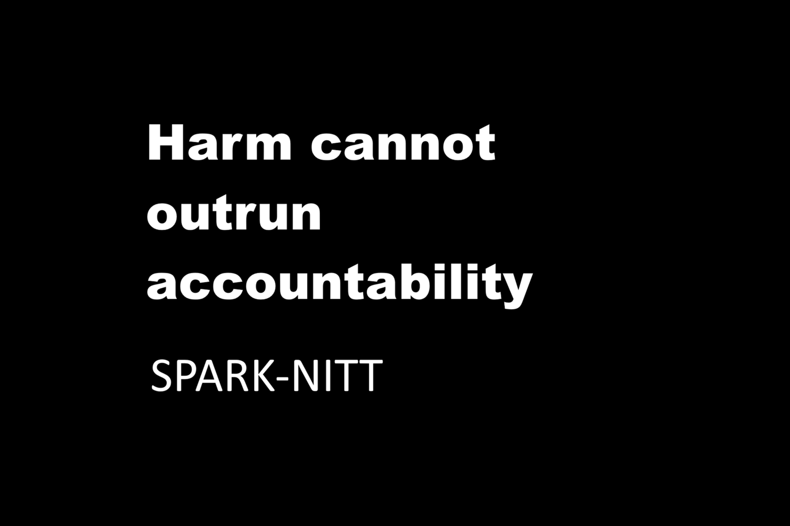

# HIN-FAIR — High-Impact Node Fairness Standard

High-Impact Node Fairness (HIN-FAIR) is a governance standard for identifying when powerful nodes — institutions, platforms, agencies, systems, offices, and infrastructures that can move harm at scale — are structurally unfair.

It does not care about intent, branding, or prestige.

It asks a simple question:

> Is the amount of harm a node can impose matched by the amount and speed of accountability it is forced to carry, at the speed harm travels?

If the answer is “no,” the node is structurally unfair, even if everyone inside it is nice.

---

## Position in the SPARK-NITT governance stack

HIN-FAIR sits alongside other governance standards in the SPARK-NITT stack. It focuses specifically on **fairness of harm vs accountability** for High-Impact Nodes (HINs).

It is designed to complement (not replace) other standards such as:

- **NITT** — identity continuity and non-teleportation
- **IRST** — recursive systems transparency
- **HRIS 3.2.4(b)** — human recursive integrity and coherence
- **CTGS** — consumer transparency in corporate systems
- **PLANT-COMMONS** — protection of nutrient commons
- **CAP-ROC** — capacity-aware risk and oversight

HIN-FAIR answers the question: **“Is this node’s harm power matched by real, timely accountability?”**

Other standards answer questions about **identity**, **transparency**, **coherence**, **consumer harm**, **nutrient commons**, and **capacity-aware risk**.

---

## What HIN-FAIR does

HIN-FAIR defines:

- a way to **identify High-Impact Nodes (HINs)** in civic, technical, financial, planetary, and informational systems;
- a set of metrics around:
  - **Harm Capacity (HC)** — how much harm a node can do;
  - **Accountability Capacity (AC)** — how much real accountability can reach it;
  - **Harm Velocity (HV)** — how fast harm moves through/ from it;
  - **Accountability Latency (AL)** — how long it takes for accountability to land;
- a fairness relation between these quantities.

At the core is a simple fairness invariant:

> When accountability latency exceeds harm velocity for sustained periods, injustice becomes systemic.

The standard defines how to describe and compare HINs using these metrics so that:

- powerful nodes cannot hide behind “complexity” or “scale”;
- regulators, communities, and researchers can reason about fairness structurally;
- corporate or state actors cannot cherry-pick feel-good metrics while leaving systemic unfairness intact.

---

## Files in this repository

Planned minimal layout (v1.1):

- `docs/HIN_FAIR_GOVERNANCE_v1.1.md`  
  Canonical governance text (normative).

- `docs/HIN_FAIR_BACKGROUND_NOTES_v1.1.md`  
  Non-normative explanatory notes, examples, and narrative context.

- `meta/HASHES.md`  
  SHA-256 hashes for the canonical documents.

- `meta/NOTARIZATION.md`  
  Optional external timestamping / notarization log (e.g. OpenTimestamps).

- `LICENSE`  
  License for this repository.

`README.md` is **not** part of the hash surface. Only the files listed in `meta/HASHES.md` are treated as canonical for integrity purposes.

---

## License

Non-commercial redistribution is allowed **only as an unchanged copy**. **No derivatives.**
Commercial use (including sale/monetization) requires a separate paid license from the author.

See `LICENSE`.

---

## How to cite

When referring to this standard, use:

> HIN-FAIR — High-Impact Node Fairness Standard v1.1 (SPARK-NITT)

and, if relevant, mention which companion standards are in play (for example, “HIN-FAIR + CAP-ROC” or “HIN-FAIR + PLANT-COMMONS + PCA”).
